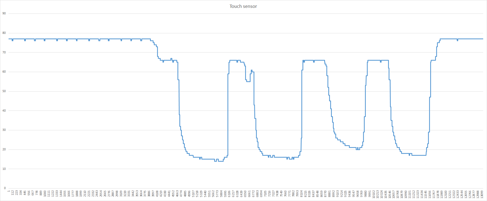

# Description
This repository contains an empty project of `ESP32`. You can setup the environment issuing the command 
```c++
pio project init --board esp32doit-devkit-v1 --project-option "framework = arduino" --project-option "platform = espressif32" --project-option "monitor_speed = 115200"
```
using the `PIO` terminal. This command will ensure creating files and folders needed to handle the project. Use the command `pio run -t monitor > data.csv` to redirect the output to a file in order to keep trace of different values. This also helps to select an accurate `threshold`.

In order to illustrate the bouncing phenomenon, we gathered all the reading while touching the sensor. In this figure, clearly the reading is on both sides of the threshold value (35). This may trigger the interruption as many times as the reading value gets through the threshold. 
Therefore, the `touchAttachInterrupt` function may be fired many times for just one touch. A correction is strongly needed.

